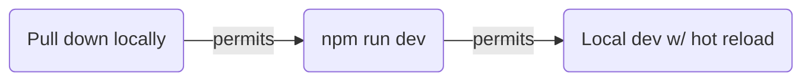
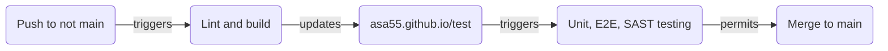
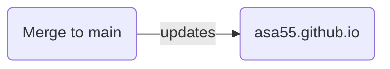

 

## ℹ️ Dev dependencies

Not limited to this, it's what I'm using:

* Win11 (OS)
  * Chocolatey (Windows client software management)
    * VSCode (Editor)
    * git (VCS) (integrated with GitHub ofc using buitin cred manager and OAuth versus e.g. a PAT)
    * NodeJS (Comes with NPM for package management and enables local dev server)

## ℹ️ Development workflow

## ℹ️ Integration workflow

## ℹ️ Deployment workflow

## ℹ️ Security

* Branch protection rule on main requries passing status for CodeQL scan prior to merge
* Dependabot is enabled
* GitHub Secrets are used for repo secrets

## ℹ️ Testing

* Unit (vitest), E2E (Playwright), SAST (CodeQL) tests are part of CI pipeline
* Local development results in the creation of a dist folder with contents. Following local development, this can get pushed upstream or not, doesn't really matter, it gets paved over by CI/CD pipelines with fresh build content regardless
* E2E testing happens on the asa55.github.io/test endpoint, before changes make their way to asa55.github.io

## ℹ️ License

Source code is MIT, all rights reserved for site content. In plain language, feel free to use anything except information about me.
