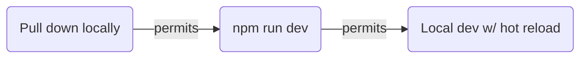
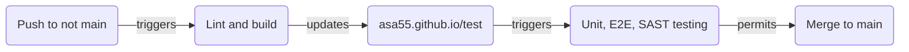
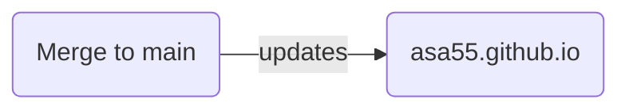

 

## ℹ️ Dev dependencies

Not limited to this, it's what I'm using:

* **OS** Win11 (22H2)
  * **software manager** Chocolatey
    * **editor** VSCode
    * **version control** git
    * **dev server** NodeJS
      * **frontend framework** React
      * **lang/compatibility** Typescript
      * **task runner** NPM scripts
      * **module bundler** Vite
      * **CSS framework** Bulma

## ℹ️ Development workflow

## ℹ️ Integration workflow

## ℹ️ Deployment workflow

## ℹ️ Security

* Branch protection rule on main requries passing status for CodeQL scan prior to merge
* Dependabot is enabled
* GitHub Secrets are used for repo secrets

## ℹ️ Testing

* Unit (vitest), E2E (Playwright), SAST (CodeQL) tests are part of CI pipeline
* E2E testing happens on the asa55.github.io/test endpoint, before changes make their way to asa55.github.io

## Conventions

* Project structure based largely on `vite-react-app` defaults
* Test definitions in `/tests/`
* Delivery bundle in `/dist/`

## ℹ️ License

Source code is MIT, all rights reserved for site content. In plain language, feel free to use anything except information about me.
